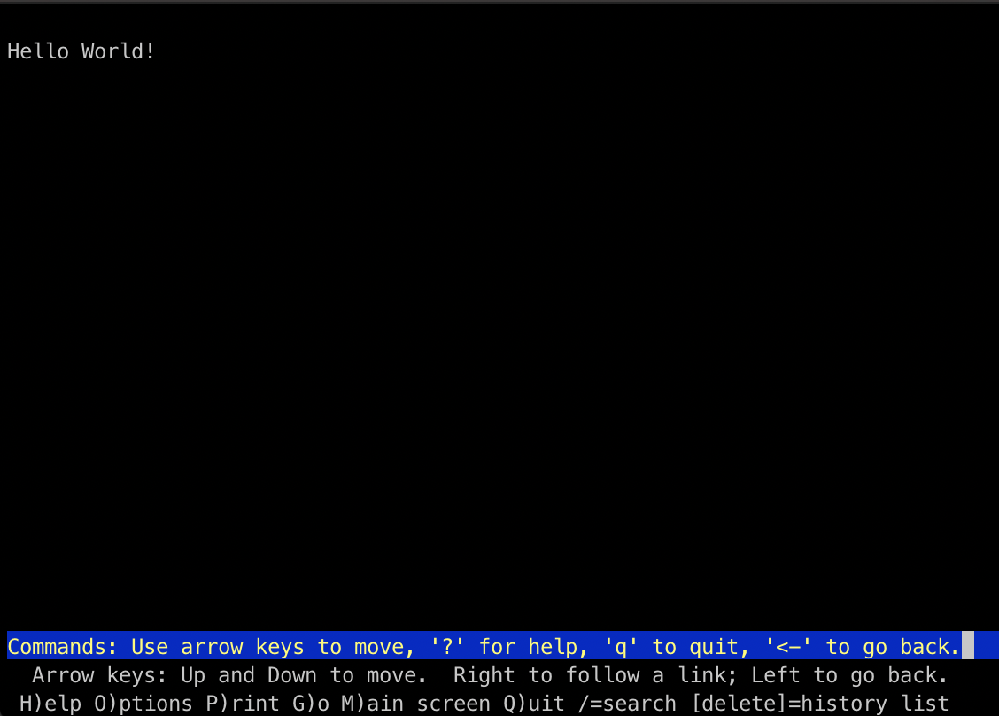

# Web Server
These tasks requires 3 VM hosts: `lab1` (10.0.2.8), `lab2` (10.0.2.9) and `lab3` (10.0.2.10). 

> [Lynx](https://lynx.browser.org/ "Lynx Reference") is a text browser for the World Wide Web which is used for these tasks. Lynx can be install using the command `sudo apt-get install lynx`

## Apache2

- This task requires lab2 to install Apache2 server and serve the Apache default webpage using lynx. Further the using the SSH port forwarding the Apache default webpage should be served in a browser in the host system. The required steps are enumerated below:

>[Apache](https://help.ubuntu.com/lts/serverguide/httpd.html "Apache Web Server Reference") is the most commonly used Web server on Linux systems and are used to serve Web pages requested by client computers. 

1. Installing Apache2 in lab2: 

        sudo apt-get update && sudo apt-get upgrade -y
        sudo apt-get install apache2

2. Serving a default web page using Apache2:

        lynx localhost

    

    The default web page is served using the html file `/var/www/html/index.html`. The default page configuration is specified in the `000-default.conf` file present in the location `/etc/apache2/sites-available`.

3. SSH port forwarding to load web page local web browser: 

    This can be done using the `ssh` command, the mapping of the ports can be done using the `L` flag as shown below:

        ssh -L localhost:1234:10.0.2.9:80 -p 10011 lab2@localhost
    
    Port number `80` (the HTTP port) from the VM lab 2 is forwarded to port number `1234` of the host system. This web page can now loaded in browser with the URL `http://localhost:1234/` as shown below: 

    

## Serving Webpage Using Node.js

- This task requires to install nodejs on lab3 from package manager and create a HTTP application helloworld.js listening on port 8080 that serves a web page
with a text "Hello world!". The steps required are enumerated below:

>Node.js 

1. On `lab3`, nodejs is installed as follows:

        sudo apt-get update && sudo apt-get upgrade -y
        sudo apt-get install nodejs

2. To serve a web page with text "Hello World!", a HTTP application `helloworld.js` is created that is listening on the `port 8080`.

    The javascript code `helloworld.js` is as follows:

    ```javascript
    //helloworld.js

    var http = require('http');

    http.createServer(function (req, res) {
        res.writeHead(200, {'Content-Type': 'text/plain'});
        res.end('Hello World!');
    }).listen(8080);
    ```   

3. To run the server, the following command is executed:

        node helloworld.js 

4. The web page served by the server can be viewed using a browser. Here lynx is used to view the web page that server is serving at port 8080. 

        lynx lab3:8080

    The output would be:
    
    

- 

-  

## Configuring SSL for Apache2

- For this task a 2048-bit key is generated for the Apache2 server and a matching certificate. Apache server is configured to utilize this certificate for HTTPS traffic. The required steps are enumerated below:

1. Generate 2048-bit key and the corresponding certificate

        sudo openssl req -new -newkey rsa:2048 -x509 -sha256 -days 365 -nodes -out MyCertificate.crt -keyout MyKey.key
2. Placing the certificate `MyCertificate.crt` and key `MyKey.key` at the following location `/etc/ssl/certs/` and `/etc/ssl/private/` respectively.
3. Here SSL is being configured for the default web page served by the Apache2 server. For this the following information is appended to the file `/etc/apache2/sites-available/000-default.conf`:

    ``` xml
    <VirtualHost *:443>

        SSLEngine On
        SSLCertificateFile /etc/ssl/certs/MyCertificate.crt
        SSLCertificateKeyFile /etc/ssl/private/MyKey.key

        ServerAdmin webmaster@localhost
        DocumentRoot /var/www/html

        ErrorLog ${APACHE_LOG_DIR}/error.log
        CustomLog ${APACHE_LOG_DIR}/access.log combined
    </VirtualHost>
    ```
4. The following command is executed to ensure that the Apache SSL module is enabled:

        a2enmod ssl
5. Now the server is restarted with the command:

        service apache2 restart
6. To verify if SSL is configured, SSH port-forwarding can be used. Note that here port 443 (HTTPS port) is forwarded from the VM lab2 to the host machine's port 1234 with SSH:

        ssh -L localhost:1234:10.0.2.9:443 -p 10011 lab2@localhost

    The browser from the host system can be used to access the web page from the SSL-enabled server by providing an HTTPS URL - https://localhost:1234/.

    Since the browser tries to verify the certificate created above and the as certificate cannot be verified, it will throw a warning that the site cannot be trusted:

    

    After proceeding by accepting the risk in the advanced options, the default web page will be served:

    

-

-

## Enforcing HTTPS

- For this task a subdirectory called `secure_session` is created to the public_html directory of the user `lab2`. The userdir module is used to serve public_html from the user's home directory and HTTPS is enforced using `mod_rewrite` and `.htaccess`. The steps required for this task are enumerated below:

1. Enable Apache2 to use the userdir module with the following command:

        sudo a2enmod userdir
2. Now to access the `public_html` directory:

        mkdir ~/public_html
        chmod -R 755 ~/public_html

    Apache server is restarted for the changes to take affect.

        sudo service apache2 restart
3. To activate mod_rewrite module:

        sudo a2enmod rewrite
    Apache server is restarted for changes to take affect.

        sudo service apache2 restart

>The [mod_rewrite](https://httpd.apache.org/docs/2.4/mod/mod_rewrite.html "mod_rewrite module reference") module uses a rule-based rewriting engine, based on a PCRE regular-expression parser, to rewrite requested URLs on the fly.

4. Now the subdirectory `secure_session` is created in the `public_html` directory:

        cd ~/public_html
        mkdir secure_session
        cd secure_session

5. The URL rewrites can be setup using `.htaccess` file in the directory; `.htaccess` file is a way to configure the details of the website without altering the server config files. The file is placed in `secure_session` directory since the rewrite rule only applies to that directory.

        sudo vim .htaccess

    The contents of the file are the Rewrite rules, this rule is specifically made for this task:

        RewriteEngine On
	    RewriteCond %{HTTPS} off
	    RewriteRule .* https://lab2%{REQUEST_URI} [R=301,L]
    
    Apache server is restarted for changes to take affect.

        sudo service apache2 restart

6. This configuration can be verified by using lynx:

        lynx http://localhost/~lab2/secure_session
    
    It can be seen that the query will change from http://localhost/~lab2/secure_session to https://localhost/~lab2/secure_session during execution.

- 

- 

## Nginx as a Reverse Proxy

- For this task, nginx is installed on `lab1` and it is configured to act as a gateway to both Apache2 at lab2 and Node.js at lab3. Specifically HTTP requests to http://lab1/apache are directed to Apache2 server listening on lab2:80 and requests to http://lab1/node to Node.js server on lab3:8080.